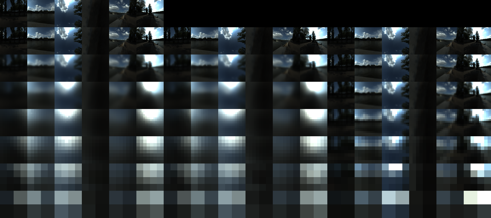

# FilterFitter



FilterFitter generates the small lookup tables that blur reflection probes.

It implements the method from Manson and Sloan, "Fast Filtering of Reflection Probes", EGSR 2016, for the Esoterica Engine. The paper published four tables and none of them apply here: this engine's roughness curve is not the paper's, and a table only works for the curve it was fitted for. So the tool fits its own, for any lobe shape, any roughness curve and either base map.

If you change the BRDF, refit your tables with this tool. It runs offline, on the CPU, once per profile and roughness curve.

Sections 1 and 2 set out the problem and the approximation, 3 and 4 what a table means and how a runtime reads one, 5 the fitted result and the corpus it is measured on, and 6 to 9 the usage, the operational facts, the limits and the disclosure.

## 1. The problem

A shiny surface reflects its surroundings. The BRDF says how much light the surface sends back, and in which directions. A rough surface reflects a blurred version: the rougher the surface, the wider the blur.

A reflection probe is a picture of the surroundings, taken at one point in a scene, that is used to light shiny surfaces. Blurring that picture by the right amount is what makes a rough surface look rough rather than polished.

The blur has a shape, called the specular lobe. A mirror sends light out in one direction; a rough surface spreads it over a range of directions, because every point on the surface is tilted a little differently. The lobe says how much light goes in each direction within that range: narrow for a smooth surface, wide for a rough one. "Specular" is the mirror-like part of reflection, as opposed to the diffuse part, which spreads light in all directions.

For each direction `n` and each roughness, the renderer needs the average of the environment weighted by that lobe:

```
              integral over the hemisphere of  L_env(l) * D(h) * (n.l) dl
    L(n)  =   -----------------------------------------------------------
                       integral over the hemisphere of  D(h) * (n.l) dl

    h = normalize( n + l )
```

- `L_env(l)` is the environment map: the surroundings, stored as an image giving the light arriving from each direction `l`.
- `D` is the distribution of microfacet normals: how the tiny bumps on the surface are tilted. That is what decides the shape of the lobe. The engine uses GGX.
- `h` is the half vector, halfway between the view direction and the light direction.
- The denominator normalises, so a constant environment stays constant.

`n` is the surface normal and also the direction the result is for. In this method the two are the same.

The environment is a reflection probe: a base map holding the surroundings, plus a mip chain of successively blurred copies of it.

Three base maps are supported: a **cubemap** (six square faces in six textures), a **single-slice tetrahedral map** (four triangles packed into one square texture, after Liao et al), and a **single-slice octahedral map** (the sphere mapped to an octahedron and unwrapped into one square, after Praun and Hoppe).

For a real environment map this integral has no closed form, and computing it by brute force takes thousands of samples per pixel. That is affordable offline and not affordable per frame.

## 2. What is approximated

The paper replaces the integral with a small, fixed number of texture reads. Each read is called a tap, and each tap needs three things: a direction, a mip level in the environment's chain, and a weight.

```
              sum over taps of  w_i * L_env( level_i, dir_i )
    L(n)  =   ------------------------------------------------
                    sum over taps of  w_i
```

The taps are not fixed. They depend on the direction `n`, and the shader computes them at run time from a polynomial:

```
    dir0    = c0 + c1 * theta^2 + c2 * phi^2
    dir1    = c0 + c1 * theta^2 + c2 * phi^2
    dir2    = c0 + c1 * theta^2 + c2 * phi^2
    level   = c0 + c1 * theta^2 + c2 * phi^2
    weight  = c0 + c1 * theta^2 + c2 * phi^2
```

`theta` and `phi` are two coordinates derived from `n`, and `dir0`, `dir1`, `dir2` are the components of the tap's direction in the local frame of the output texel. All five quantities are quadratics in `theta` and `phi` with no linear term, which is what keeps the taps continuous where two axial frames meet.

**The polynomial coefficients are what the table stores.** Nothing else about the filter is stored.

One table has seven rows, one per level of the output mip chain, from 128 texels down to 2. A level is six 128x128 faces for a cubemap, and a single 128x128 square holding four triangles for a tetrahedral map. Each row says how to blur the environment at that level.

The output chain stops at 2x2 rather than continuing to 1x1, because a 1x1 face holds a single direction and cannot describe a hemisphere. The chain the taps read still runs to 1x1: a table row reads its own level and coarser ones, and the coarsest row's taps reach well past their own level. That chain is therefore eight levels, 128 down to 1, one longer than the table. The eighth level is what keeps the coarsest row's taps from clamping early.

Four table shapes come from the paper:

| shape      | taps per axis | total taps | polynomial terms         | coefficients per level |
|------------|---------------|------------|--------------------------|------------------------|
| `const_8`  | 8             | 24         | constant only            | 120                    |
| `const_16` | 16            | 48         | constant only            | 240                    |
| `const_32` | 32            | 96         | constant only            | 480                    |
| `quad_32`  | 32            | 96         | constant, theta^2, phi^2 | 1440                   |

A coefficient count is taps x 5 parameters x polynomial terms, and these are the numbers the fitter solves for. A shape outside this set is a shape with its own tap count and its own term count, and the fitter produces one for either base map: the shape is a property of the table, not a menu of four.

More taps and more terms mean more accuracy and more run-time cost, and the cost is dominated by the taps. A tap is a sample of the environment's chain; the coefficients are wavefront-uniform reads of a small buffer and a few multiplies, so the terms are close to free next to the samples.

## 3. The two base maps, and why the table has an axis count

Each tap is placed in an **axial frame**: a tangent basis built around one axis of the base map. A direction selects the frames it needs, and the taps are divided between them.

How many frames exist is a property of the base map:

| map                      | frames                        | frames active at one direction | total taps, `const_8` |
|--------------------------|-------------------------------|--------------------------------|-----------------------|
| cubemap                  | 3, one per axis               | 2, and a 3rd near a corner     | 24                    |
| single-slice tetrahedral | 4, one per tetrahedron vertex | 2 to 4                         | 32                    |
| single-slice octahedral  | 3, the same axial frames as a cubemap | 2 to 3                 | 24                    |

A frame is dropped when its blend weight reaches zero. That weight is zero while the direction is close to the frame's axis and grows as the direction moves away from it. Both maps use 0.75 as the threshold, and each measures distance in its own coordinates: a cubemap uses the largest of the two off-axis components of the direction, each divided by the on-axis one, and a tetrahedral map uses `|d . v|`, the alignment with the frame's vertex.

On a cubemap this leaves two frames over most of a face and three near a corner. On a tetrahedral map it leaves two to four.

The published tables are cubemap tables, so they have three axes. A tetrahedral table with the same tap count and the same polynomial order has the same structure with four. The axis count is therefore part of the table: it is stored in the binary and in the text header, and a checkpoint written with a different axis count is refused rather than reused.

The two maps also correct the sampled mip level differently, because a texel covers a different amount of the sphere in each. That amount is the texel's solid angle, the area of the sphere that the texel covers:

| map         | level added at a sampled direction                                      | range                   |
|-------------|-------------------------------------------------------------------------|-------------------------|
| cubemap     | `0.75 * log2( dot( d, d ) )`, with `d` divided by its largest component | 0 to `0.75 * log2( 3 )` |
| tetrahedral | `-1.5 * log2( n . L )`, with `L` the triangle the sample lands in       | 0 to `1.5 * log2( 3 )`  |
| octahedral  | `1.5 * log2( \| p \| )`, with `p` the L1-normalized direction           | `-0.75 * log2( 3 )` to 0 |

The tetrahedral span is exactly twice the cubemap's, which is the factor of two in its Jacobian: the ratio between area on the map and area on the sphere. Nothing else about the construction changes between the maps.

**The exact integral is still computed, offline.** It is called the reference. It uses thousands of samples per texel on the CPU. The reference is the target: the tool fits the taps to it.

### The cubemap is the accurate map, and why

A tetrahedral table is roughly 2.5x worse in radiance than a cubemap table of the same shape at the same nominal resolution, and that is the map rather than the table.

A tetrahedral level at resolution R holds R x R texels over the whole sphere, where a cubemap level holds six faces of R x R. Its texels therefore cover about six times the solid angle, so each one averages a much larger patch of incoming light, and the levels whose lobe is narrow relative to a texel are correspondingly harder to place. The energy is right at both maps - the table's convolution matches the reference's mean - so the difference is placement error, not a normalisation error.

A runtime that wants tetrahedral probes as accurate as cubemap ones at the same lobe width has to use a higher base resolution. The tool supports the tetrahedral map because a tetrahedral probe needs a table of its own, not because it is the better choice where six faces are available.

An octahedral map is also supported, and it is **not shipped**: it is measured and kept as an alternative. Its parameterization sets an accuracy floor no fit of it has beaten, the tradeoff it offers is a smaller and cheaper filter, and the measurements and reasoning are in [Docs/Rendering/Octahedral Reflection Probes.md](../../Docs/Rendering/Octahedral%20Reflection%20Probes.md).

An octahedral level is also one square over the whole sphere, so its texels carry about six times a cube level's solid angle in the same way a tetrahedral map's do. It should do better than the tetrahedral map at equal resolution, because its parameterization is near-uniform in texel footprint - each of the eight octant regions has fixed axis signs, so edges stay straight and the footprint distortion stays bounded - where the tetrahedral tile's is not. **Its measured accuracy has not been taken yet**: the table has been fitted and validated on the corpus once that measurement exists, and until then this paragraph is a geometric expectation rather than a result.

## 4. Reading a table at run time

The sampling side is in the provided HLSL files: one for a cubemap, one for a tetrahedral map. Each takes one output direction, builds the taps the table prescribes, and sums the weighted reads. That is the same construction the fitter solves for, so a reader that follows it matches the tables.

What they need from the tool is one table. `--write-binary` writes a 144-byte header, then the coefficients as `float4`s in this order:

```
    float4[ level ][ parameter ][ coefficient ][ index ]
```

`index` is `numSuperTaps * axis + superTap`, and `numSuperTaps` is `numTapsPerAxis / 4`. The four components of one `float4` are the four sub-taps of one index.

The parameters are five per tap, in this order: `dir0`, `dir1`, `dir2`, the level correction, and the weight. The coefficients are one for a constant table and three for a quadratic one, the second and third being the `theta^2` and `phi^2` terms.

The header describes the layout, so a reader can check it instead of assuming it:

| offset | field                 | meaning                                                          |
|--------|-----------------------|------------------------------------------------------------------|
| 0      | magic                 | `'FTBL'`, so a wrong file is refused rather than interpreted     |
| 4      | version               | 4                                                                |
| 8      | numLevels             | 7                                                                |
| 12     | numParameters         | 5                                                                |
| 16     | numActiveCoefficients | 1 for a constant table, 3 for a quadratic one                    |
| 20     | numTapsPerAxis        | 8, 16 or 32                                                      |
| 24     | projection            | 0 cubemap, 1 tetrahedral, 2 octahedral                           |
| 28     | numAxes               | 3 cubemap, 3 octahedral, 4 tetrahedral                           |
| 32     | numIndices            | `numAxes * numTapsPerAxis / 4`                                   |
| 36     | numFloat4             | `numLevels * numParameters * numActiveCoefficients * numIndices` |
| 40     | payloadOffset         | 144                                                              |
| 44     | payloadBytes          | `numFloat4 * 16`                                                 |
| 48     | shapeName[16]         | text                                                             |
| 64     | profileName[48]       | text                                                             |
| 112    | widths[7]             | one float per level, for the curve the table was fitted for      |

Two of those fields cannot be read from the header at run time, because they are compile-time in a shader that unrolls its loops: the tap count and the coefficient count. The engine holds both in one place, `Code/Engine/Render/Shaders/PBR/ProbeTableShape.esh`, which the gather and the check of the embedded table's header both include. A table whose header disagrees with it trips that check rather than being read at the wrong index.

Per output texel the shader normalises the output direction, keeps every axial frame whose blend weight is positive, and emits four sub-taps per super-tap. Each sub-tap reads the five quadratics in `( theta^2, phi^2 )`, forms a direction in the frame, adds the level correction, and samples the environment.

The result is the sum of the weighted reads divided by the sum of the weights.

Two things the runtime has to decide that the provided files do not:

- **The tile's edges.** A single-slice tetrahedral map puts four different faces against one square's border, so a hardware bilinear read near the edge mixes two faces that do not meet there. The tool's own convolution resolves every tap through direction space instead, which is exact but costs four reads and a coordinate conversion per tap. Start with the hardware read and decide from your own measurements whether the seams need the resolved one;
- **Roughness zero.** A zero-width level is the identity, and the engine reaches it by sampling mip 0 directly rather than by reading the table. A table fitted with a zero-width level stores a mirror level (`-0.75 * log2( 3 )` for a cubemap, `-1.5 * log2( 3 )` for a tetrahedral map, and `0` for an octahedral one), which holds the sampler at or below mip 0 at every direction, so the table is correct there too, but skipping it costs less. The octahedral map's is zero rather than negative because its correction is never positive: an octahedral correction is `1.5 * log2( | p | )` with `| p |` at most 1, so level 0 already saturates the sampler at mip 0 everywhere, where a cube's and a tetrahedral map's corrections both go positive somewhere and need a negative level to cancel that.

## 5. The fitted cubemap table, and how it is measured

The table this project ships is a **`const_8` cubemap table**: 8 taps per axis, one coefficient term, fitted with seven seed starts and trained at a grid of 8 in the level's own texel space. It is fitted for the engine's roughness curve, which is roughness linear across the seven levels.

Seven starts rather than one is not a belt-and-braces choice. The candidate seeds come from the analytic initialisation and are ranked by their own objective value, and that ranking does not predict where the optimizer lands: at several levels the ranked-first seeds were not the ones that reached the lowest minimum. Trying all seven and keeping the best costs fit wall clock and nothing at run time.

### Error in radiance, on the corpus

Measured over the whole environment corpus, 425 assets. The reference and the approximation are compared per level. Relative L1 means total absolute difference divided by the reference's own total, so 0.01 is a 1% average error.

```
table                     lvl 0    lvl 1    lvl 2    lvl 3    lvl 4    lvl 5    lvl 6    mean 1-6
const_8                   0.1225   0.0396   0.0371   0.0348   0.0394   0.0828   0.0477   0.0469
const_16                  0.1216   0.0320   0.0320   0.0258   0.0327   0.0594   0.0528   0.0391
const_32                  0.1217   0.0302   0.0296   0.0194   0.0258   0.0592   0.0443   0.0348
quad_32                   0.1229   0.0220   0.0183   0.0129   0.0202   0.0266   0.0354   0.0226
fitted_esoterica          0.0000   0.0465   0.0379   0.0427   0.0493   0.0508   0.0439   0.0452
```

The first four rows are the paper's published tables, scored under the paper's roughness curve, because that is the only curve their widths mean anything at. The last row is this tool's cubemap table, scored under the curve it was fitted for. All five are scored over the same 425 assets.

**The fitted table beats the paper's published `const_8` on the corpus**, 0.0452 against 0.0469, with the same tap count - and it does that while the published table is scored under the curve it was fitted for. It also beats their `const_16` at levels 5 and 6, 0.0508 against 0.0594 and 0.0439 against 0.0528, with half the taps.

The reason is the curve rather than the fitting. This project's curve is linear in roughness across the levels, so level 0 is a mirror: exact for the cubemap, which is why its level 0 reads 0.0000 while the published tables sit at 0.12, where the paper's geometric curve puts its narrowest and hardest lobe. The remaining levels then sit at different widths from the paper's, and this engine's radiance chain is what decides those widths, so the table is fitted where the runtime samples.

A consequence worth stating plainly: the comparison is not a like-for-like contest of fitters. Each table is scored through its own curve, which is the only curve it can be scored through, and the fitted row's advantage is a statement about that curve and the widths it implies.

## 6. The environment corpus is the acceptance test

The corpus is 425 assets across day, evening, morning, night, indoor and synthetic sky families. It is what a table is judged on, and `--hdri-validate` over it is the measurement that decides whether a candidate is kept.

`--hdri-limit <n>` stops after n assets and is worth using to save time while iterating, but it must never be used to decide. The assets come in a stable order, and the first ten of the corpus are all `DayEnvironmentHDRI`: one family of slightly cloudy skies. They turn out to be harder than average rather than easier - every table in the list above scores 12-18% better on the corpus than it does on those ten - so a subset understates quality. It happens to preserve the ranking between tables, which is why a subset comparison can still be informative, and a ranking is not a result.

For the same reason, a number is only worth quoting with the set it was measured on. The table in section 5 is a corpus table, and it is the only radiance result this document states.

## 7. Using the tool

Fit a table, then write it out:

```
FilterFitter.exe --fit --curve esoterica
FilterFitter.exe --write-header --write-binary --curve esoterica
```

The fit is resumable: it checkpoints after every level, and an interrupted fit is continued rather than repeated. `--reset` discards the checkpoint so the fit starts from level 0 again. Outputs, written in `External\FilterFitter\` whichever directory the tool was run from:

```
ReflectionProbeTable_ggx_esoterica_cube.h
ReflectionProbeTable_ggx_esoterica_cube.bin
FilterFitter_ggx_esoterica.fit          the checkpoint, cubemap
```

The binary is what the engine reads; the header is the same data as text. Derived names carry the profile, the curve and the map, so two configurations can be fitted and kept side by side and a table is never picked up for the wrong map.

For a tetrahedral probe, add `--projection tetrahedron` to every command:

```
FilterFitter.exe --fit --write-header --write-binary --projection tetrahedron --curve esoterica
```

```
ReflectionProbeTable_ggx_esoterica_tetrahedron.h
ReflectionProbeTable_ggx_esoterica_tetrahedron.bin
FilterFitter_ggx_esoterica_tetrahedron.fit
```

`--fit-seeded` is the same fit seeded from the published `const_8` of the same shape rather than from the analytic initialisation: the refinement path rather than the generation path. Only the four published shapes have such a seed, and all four are cubemap tables.

To measure a table against real environments:

```
FilterFitter.exe --hdri-ingest   "E:\mtld\.mtld-texture-cache"
FilterFitter.exe --hdri-validate "E:\mtld\.mtld-texture-cache" --curve esoterica
```

Ingest decodes each panorama into the selected base map and caches it. The two maps cache separately, under the same environment directory. Only equirectangular panoramas are supported.

Validate convolves every environment twice, once by brute force and once from the table, and reports the difference. Both stages cache their results, so re-running is fast. A cubemap run validates the four published tables beside the fitted one; a tetrahedral or octahedral run validates the fitted table and nothing else, because the published tables are cubemap data.

Results are written as EXR, one file per slice per level, under `External\FilterFitter\hdri\<environment>\<stage>\`.

### The DFG table

The specular split of the environment lookup is the other half of the picture: `radiance * (F0 * scale + bias)`, where `scale` and `bias` are a 128x128 lookup over `N·V` and roughness. The engine used to evaluate that integral on the GPU every frame; this tool evaluates it offline at a sample count a frame cannot afford, and the engine uploads the result.

```
FilterFitter.exe --dfg
```

It writes `DFGTable_esoterica.bin` and `DFGTable_esoterica.h` in `External\FilterFitter\`, next to the radiance tables. The integral is the engine's own - `alpha = roughness²`, `k = roughness / 2`, the half-vector sampled from the NDF - and it is written out in `Source/DFGIntegrand.h` with the conventions beside it.

The run evaluates the table, measures it against a reference at a higher sample count, compares two rows against a deterministic quadrature of the hemisphere written from the BRDF longhand, checks that every value survives the half-float storage, and prints PASS or FAIL. It is a mode of its own: the term depends on no map, no tap layout, no fit, no profile and no curve, so `--profile`, `--curve` and `--widths` do not apply to it.

### Command line options

Running with no arguments prints the usage, runs the per-stage self-checks and the published-table conformance test, and prints `OVERALL : PASS` when everything holds. That is the check to run after touching the tool.

**Fitting.**

| option        | effect                                                                                                                     |
|---------------|----------------------------------------------------------------------------------------------------------------------------|
| `--fit`       | Fit a whole table, one level at a time, then check that a second run skips finished levels and that a foreign checkpoint is refused. Resumes by default. |
| `--reset`     | Discard the checkpoint first, so `--fit` starts from level 0 again.                                                         |
| `--fit-seeded`| The same fit, seeded from the published table of the same shape.                                                            |
| `--profile <ggx\|beckmann>` | Which NDF to fit or measure. Default `ggx`, which is what the engine's `DistributionGGX` implements.          |
| `--curve <paper\|esoterica>` | The width at each level: `paper` is the reference's gloss curve at spec power 18, and `esoterica` is roughness linear across the levels. |
| `--spec-power <f>` | The paper curve's spec power. 18 reproduces the published tables.                                                       |
| `--widths <w0,...,w6>` | One width per level, for a fork whose roughness remap is neither. Overrides `--curve`.                              |
| `--projection <cube\|tetrahedron\|octahedral>` | Which base map this run is for. It selects the frame the fit and the checks build, the shape the fit produces, the name of every artifact and checkpoint, and the map the HDRI stages are cached and convolved under. |

**Writing tables.**

| option                  | effect                                                                                                    |
|-------------------------|-----------------------------------------------------------------------------------------------------------|
| `--write-header [path]` | Write the fitted table as a C header, shaped like the vendored reference tables. Needs a complete checkpoint. |
| `--write-binary [path]` | Write the same table as the raw binary the engine's DataEmbed tool consumes. Can be given with `--write-header`, and the checkpoint is read once for both. |

With no path, the name is derived from the profile, the curve and the map, in the FilterFitter folder:

```
    FilterFitter_<profile>_<curve>.fit                  checkpoint, cubemap
    FilterFitter_<profile>_<curve>_<projection>.fit     checkpoint, every other map
    ReflectionProbeTable_<profile>_<curve>_<projection>.h/.bin   outputs
```

The cubemap checkpoint is the one name without a projection, and it is kept that way because renaming it would orphan the checkpoint of a completed fit. A checkpoint renamed to another configuration is refused on load rather than written out under a name it does not have.

**Diagnostics.** These answer questions about the fit and about the conformance difference. Each runs alongside the self-checks, and none of them changes a table.

| option             | effect                                                                                                       |
|--------------------|--------------------------------------------------------------------------------------------------------------|
| `--diagnostics`    | Attribute the conformance difference to the mip chain length, the reference preimage definition, the supersampling rate, the texel measure, the output texel position and the lobe convention. About ten minutes, and only useful when investigating that difference. |
| `--benchmark`      | Measure the per-output-texel cost of one objective evaluation, split into the profile-only part and the part that depends on the unknowns, and project fit wall clock from it. Seconds. |
| `--optimizer`      | Perturb every unknown of a published `const_8` level and require the optimizer to recover to at most the published value, on the training sample and on a denser held-out sample. Minutes. |
| `--seed`           | Score the analytic initialisation against the published table at every level, with no fit. Seconds, and the only practical way to tune it. |
| `--weight-probe`   | Freeze everything but the weight coefficients at the published table and search, to measure how much the weight subspace alone has left to give. Minutes. |
| `--gradient-check` | Compare the analytic weight gradient against a one-sided difference, per coefficient, at every level. Seconds. It also runs whenever the optimizer does, because a parameter-layout mismatch is silent and produces a descent direction of entirely plausible magnitude. |
| `--irls`           | Compare the split optimizer against the joint one: a frozen-normaliser weight stage, which is convex, alternating with placement and level. Both arms from the same seed and budget. Minutes. |
| `--converge`       | Run each level to a larger budget and report how the largest gradient component behaves, to tell a truncation apart from a stationary point. Streams every iteration. About 20 min. |
| `--sample-size`    | Train levels 3 and 4 at the configured grid and at twice it, then score both tables on both samples beside the published table. Separates a gain in the filter from one in the training sample. About 40 min. |

**HDRI corpus.**

| option                    | effect                                                                                                             |
|---------------------------|--------------------------------------------------------------------------------------------------------------------|
| `--hdri-scan <root>`      | List the HDRIs in a dataset and what was rejected. Seconds.                                                         |
| `--hdri-ingest <root>`    | Decode each panorama, area downsample it, project it to a base map and cache it. Cached afterwards, so re-running is free. |
| `--hdri-validate <root>`  | Reference and table-driven convolution of every ingested HDRI, compared per level. The reference is the expensive half and is cached per sample count. |
| `--hdri-dir <path>`       | Where the projected maps live. Default `hdri/` in the FilterFitter folder.                                          |
| `--hdri-limit <n>`        | Stop after n assets, for a first look. Stable order, so the same n is the same assets every run.                    |
| `--hdri-samples <n>`      | Reference samples per output texel. Default 8192, which is converged; 1024 reproduces the engine's own realtime estimator instead. |
| `--hdri-equirect <w>`     | Equirect width before projection. Default 2048.                                                                     |
| `--hdri-force`            | Recompute cached stages instead of reusing them.                                                                    |
| `--hdri-showcase [dir]`   | Write the showcase EXRs as well: one image per interesting environment, holding the source beside the brute-force result beside the table's, at every level, each level point upsampled so the texel grid shows. `dir` is optional. |
| `--hdri-csv <path>`       | Dump every per-asset per-table per-level number, so an outlier claim can be checked against its value.              |

**DFG table.**

| option                              | effect                                                                                                          |
|-------------------------------------|-----------------------------------------------------------------------------------------------------------------|
| `--dfg`                             | Evaluate the table, measure it against a reference at a higher sample count and against a deterministic quadrature of the hemisphere, and write the binary and the C header. Prints PASS or FAIL and exits nonzero on FAIL. |
| `--dfg-resolution <n>`              | Texels per axis, both axes spanning zero to one and a texel's coordinates being its centre. Default 128, which is what the engine's lookup texture is. |
| `--dfg-samples <n>`                 | Samples per texel in the table's own evaluation. Default 16384, which is offline accuracy rather than a frame budget. |
| `--dfg-reference-samples <n>`       | Samples per texel in the reference the table is measured against. Default 65536, several times the table's, because the deviation between them cannot be smaller than the reference's own error. Raised automatically to twice the table's if set below it. |
| `--dfg-binary <path>`               | Where the binary goes. Default `DFGTable_esoterica.bin` in the FilterFitter folder.                              |
| `--dfg-header <path>`               | Where the C header goes. Default `DFGTable_esoterica.h`. An empty value skips it.                                |

## 8. Operational facts

**One fit at a time.** A fit is the expensive step and it saturates the machine: a grid-8, seven-start cubemap fit holds about seventeen cores. A second fit does not finish sooner, it only takes the machine away from whoever is using it. Nothing about a fit's result depends on how long it takes, so the rule costs nothing but waiting.

**The executable is `FilterFitter.exe`, not `EsotericaFilterFitter.exe`, and that is load-bearing.** The engine's projects run `KillEsotericaProcesses.bat` before every build, which is `taskkill /F /FI "IMAGENAME eq Esoterica*"`. A fitter named `EsotericaFilterFitter` is killed by any engine build that happens while a fit is running, and it dies silently: a killed process reports the same bare exit code as a failure, and if its output is block-buffered the last lines go with it. The fitter is an offline tool that shares nothing with the engine processes that script is after, so it is named so the wildcard cannot match it.

For the same reason the tool's stdout is unbuffered. A run that dies part way through otherwise loses the block of output that says where it died.

**Engine builds are safe during a fit; rebuilding the fitter is not.** An engine build cannot touch a running fit now that the name is fixed, but the fitter's own executable is locked while a fit or a validation is using it, so `BuildFilterFitter.bat` fails with a link error if a run is in flight. The failure is at the link step, in the middle of the output, which is easy to miss - check that the build line printed and that no link error is above it.

**The training grid is part of a checkpoint's identity.** The grid lives in `g_fitGridSize`, and the fit's fingerprint carries it, so a checkpoint records the grid that produced it and a fit at a different grid refuses it rather than resuming into it. Wall clock scales with the square of the grid, which is a cost paid once at fit time and not at all at run time.

**The HDRI validation caches convolutions per table name.** A stage directory is named for the table, and the fitted table's entries are always called `fitted_esoterica` whatever fit produced them. After a new fit, its cached entries must be invalidated - the `*fitted_esoterica*` stage directories under `hdri\<environment>\` - or the validation reuses the previous table's convolutions and reports the old row verbatim. The published tables' entries and the per-asset references are independent of the fitted table and can stay cached.

## 9. What this tool does not claim

- **It does not reproduce the paper's published tables exactly.** It reproduces their construction, and the differences are attributed by `--diagnostics`.
- **It does not claim to beat the paper's fitter.** The gain claimed in section 5 is the roughness curve and the fitter's reproducibility and control, not a better optimiser.
- **Comparisons against the published tables are biased in this tool's favour.** The fitted table was fitted against this tool's error measure, and the published tables are merely scored by that same measure, so if the difference is systematic the published tables are measured worse than they are.
- **The reference convolution is GGX only.** A Beckmann reference would need Beckmann importance sampling, which is not implemented.
- **The validated numbers assume the paper's 4-tap pass-1 downsample.** The engine currently uses a single bilinear tap for pass 1, so the numbers here do not exactly predict what the engine will produce.
- **A fitted table is reproducible only on the same machine and the same worker count.** The objective is summed in item order and does not depend on the worker count, but the gradient is accumulated per worker and reduced in worker order, and the optimizer is sensitive to that in the last bits. If your fork needs bit-identical tables, fix the worker count as well as the settings.

## 10. Disclosure

LLM assistance was used when developing this project.
